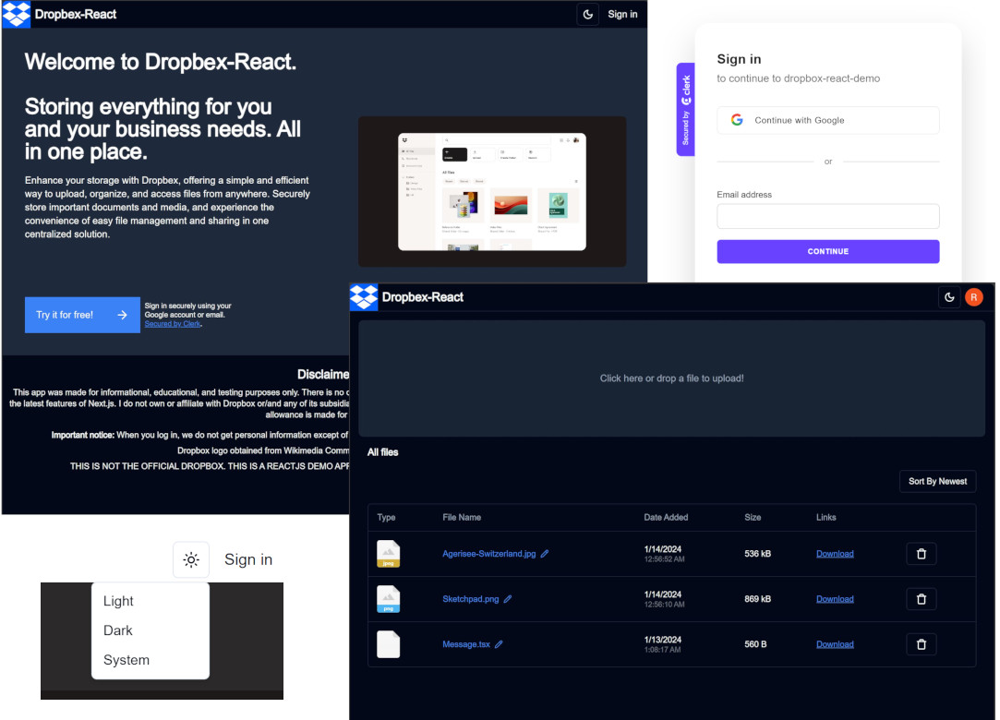

# Dropbox-React.

A Dropbox-like app that simulates Dropbox UI and functionality. Users can securely login using their Google account or sing up using their email (powered by [Clerk](https://clerk.com/)) and then upload, download, rename and delete their files simulating the real Dropbox functionality. Files are hosted in Firebase storage, and the details and association with the users are registered in the Firestore Database.

See it: https://dropbox-react.vercel.app/

## Screenshots:

<div align="center">
  
</div>

## Instructions.

1. Just Sign in/ Sing up with your Google account or email and start uploading, downloading, and renaming your files.

## Features.

- Drag and Drop functionality. The user can upload their files either by opening a File dialog or by dragging files to the app's drop zone. Powered by [react-dropzone](https://react-dropzone.js.org/), a simple react hook to create an HTML 5 compilant drag'n drop zone for files.
- Data persistence. Upload files and store them in the cloud through Firebase storage. You can add, rename, delete your personal files.
- User management. Users can Sign in securely using their Google account or email. Powered by [Clerk](https://clerk.com/). Each user can access only their own files.
- State management powered by [Zustand](https://www.npmjs.com/package/zustand).
- Dark mode functionality as well as beautiful reusable components such as button, dialog, dropdown mnenu, table and input powered by [shacdn/ui](https://ui.shadcn.com/)

## Technologies & Libraries:

The following technologies, dependencies, and services were used to make this app:

- ReactJS.
- NextJS 14.
- TailwindCSS.
- [shacdn/ui](https://ui.shadcn.com/): Beautifully designed components that you can copy and paste into your apps. Accessible. Customizable. Open Source.
- [AppWrite Cloud](https://cloud.appwrite.io/). A secure open-source backend platform which provides a set of secure APIS, tools and a management console UI to help build apps quickly. Features used: database and file storage.
- [React-Beautiful-DND](https://github.com/atlassian/react-beautiful-dnd). A beautiful and accessible drag and drop library for lists with React.
- [Zustand](https://www.npmjs.com/package/zustand). A small, fast and sacalable bearbones state-management solution using simplified flux principles.
- [react-dropzone](https://react-dropzone.js.org/), a simple react hook to create an HTML 5 compilant drag'n drop zone for files.
- [Fireabase](https://firebase.google.com/), one of the best app development platforms backed up by Google to store files through Firebase Storage and data through Firestore Database.
- [React File Icon](https://www.npmjs.com/package/react-file-icon), a package to display the file icons according to their file types.
- [react-hot-toast](https://react-hot-toast.com/), a library which provides beautiful and easy to use notifications to your React app.

This is a [Next.js](https://nextjs.org/) project bootstrapped with [`create-next-app`](https://github.com/vercel/next.js/tree/canary/packages/create-next-app).

## Getting Started

First, run the development server:

```bash
npm run dev
# or
yarn dev
# or
pnpm dev
# or
bun dev
```

Open [http://localhost:3000](http://localhost:3000) with your browser to see the result.

You can start editing the page by modifying `app/page.tsx`. The page auto-updates as you edit the file.

This project uses [`next/font`](https://nextjs.org/docs/basic-features/font-optimization) to automatically optimize and load Inter, a custom Google Font.

## Learn More

To learn more about Next.js, take a look at the following resources:

- [Next.js Documentation](https://nextjs.org/docs) - learn about Next.js features and API.
- [Learn Next.js](https://nextjs.org/learn) - an interactive Next.js tutorial.

You can check out [the Next.js GitHub repository](https://github.com/vercel/next.js/) - your feedback and contributions are welcome!

## Deploy on Vercel

The easiest way to deploy your Next.js app is to use the [Vercel Platform](https://vercel.com/new?utm_medium=default-template&filter=next.js&utm_source=create-next-app&utm_campaign=create-next-app-readme) from the creators of Next.js.

Check out our [Next.js deployment documentation](https://nextjs.org/docs/deployment) for more details.
